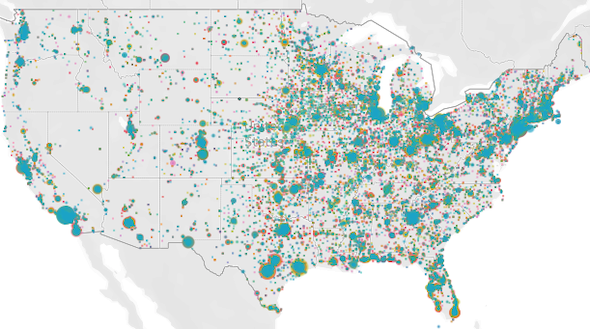
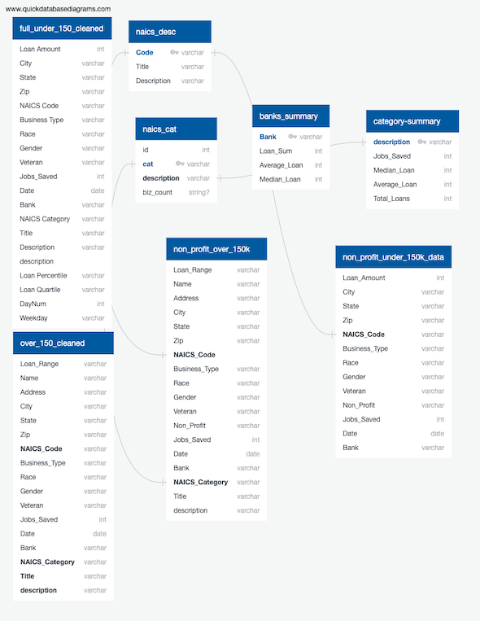

## Small business cash for covid under the "Paycheck Protection Program"

### PPP loans - stimulus money exploration
This is an E.T.L. / pipeline project that extracts, transforms and loads over 50 datasets released under the "Paycheck Protection Program" by the Small Business Association and made publically available by the U.S. Treasury Department. Otherwise known as "The PPP", these potentially forgivable loans are part of a covid relief package authored by the US Congress in an attempt to assist establishments to retain employees and "stay in business". 

#### Webpage for this project
The webpage associated with this project provides insight into some of the findings, light analysis and explanation of the data pipeline. You can access it here: 
Cash for covid <a href="https://sherirosalia.github.io/cash_for_covid_clean_machine/">Where did the Paycheck Protection Program money go?</a>

#### The data 
Almost 5 million rows of data resulted from a compilation of the 51 CSV files downloaded <a href='https://home.treasury.gov/policy-issues/cares-act/assistance-for-small-businesses/sba-paycheck-protection-program-loan-level-data'><strong>here</strong></a>. 50 CSV files have state specific, anonymized information about loans up to 150k. The one remaining CSV is nationwide and reveals the identities of the borrowers who took out loans that start at $150k and go into the millions.

#### Cash for Covid USA - small business loans across the country

#### The approach
A Python script joined the 50 state CSV files and Python Pandas was used for the majority of cleanup. Taking advantage of the extra horsepower afforded by Google Colab, a preliminary analysis and export of a smaller dataset (people_ppp.csv) was done using PySpark. Workbooks and scripts for all of these files are in this repository, but further analysis is to be done with SQL and Tableau..

#### Analysis
Application of the SciKit Random Forest Regressor machine learning and some light evaluation is done here, and further exploration is continued in this repository <a href='https://github.com/sherirosalia/cash_for_covid_deep_dive'><strong>here</strong></a>.

Even at this light stage of analysis, there have been some insights gleaned.
- The largest lenders are for the most part "brick and mortar", household names such as Wells Fargo and Bank of America, but there are a few Fintech companies that made the top 15 such as Celtic and Kabbage. 
- Machine learning processing suggests that business type category carries the most weight in terms of the amount of money lent. Race, gender and military status may not.
- The median loan amount was roughly the same as the average for women namely 34k, but male owned businesses borrowed 41k and Veterans the lowest average amount at about 21k. 
- Amongst racial groupings, based on those who responded, the number of Asians who borrowed was double the count of Hispanics despite being a smaller percentage of the population. 

Of course there are potential pitfalls to the above. For example, most borrowers declined to state their race, gender and military service status, so the figures above are based only on respondents who answered and this could inaccurately skew results. 

#### Preliminary findings
Brief explanation and analysis is here:  <a href='https://sherirosalia.github.io/cash_for_covid_clean_machine_pipeline/'><strong>PPP Loan Maps and Preliminary Analysis</strong></a>.

#### Frameworks
- Python Pandas
- PySpark
- Python
- Scikit-learn
- PostgresSQL

#### Folder Structure
Root:
- Readme.md
#### images:
- Some graphs and piecharts examining a sample dataset.
- Loans under $150 across the US
- Top banks by loan count
#### over_150_pipeline:
- The data for the larger loans was relatively clean. This notebook addresses null 
values, formatting issues and splits off some infomation about non-profit organizations into a separate csv. The final product of cleaning is stored in a csv called "over_150_cleaned.csv".
#### pandas_csv_cleaning:
- Transformation of approximately 300k rows of data that was splintered off of a PySpark notebook is explored here. Even though it is a relatively small dataset, the higher level of detail from demographic information provided dimension.
#### python_csv:
- Python script enabling union of the loan data csv files for individual states from Small Business Administration.
#### pyspark_analysis:
-  There are two notebooks. One explores the larger loan amounts and the other smaller which is labeled "ppp_pyspark.ipynb and produces the more granular "people_ppp.csv" file.
#### random_forest:
- Notebook using Pandas.
- Machine learning preparation of data.
- Random Forest regression using Scikit-learn.

#### sql_files:
- schemas, unions, general queries and analysis in 5 files.

#### under_150_pipeline
- Series of 5 notebooks taking the largest dataset through normalization and light analysis producing a number of smaller csv files along the way.

#### Deployment
- Download the files from the US Treasury linked above, deploy the script in "python_csv" and then run the resulting CSV file through "clean.ipynb" in the "pandas_csv_cleaning" folder. Notes indicate which notebooks to run sequentially. 
- PySpark script utilizes CSV file exported in clean_ppp3.ipynb.

#### National stats for loans under $150k for respondents on racial data

#### E.R.D.

Brief explanation and analysis is here:  <a href='https://sherirosalia.github.io/cash_for_covid_clean_machine_pipeline/'><strong>PPP Loan Maps and Preliminary Analysis</strong></a>.
